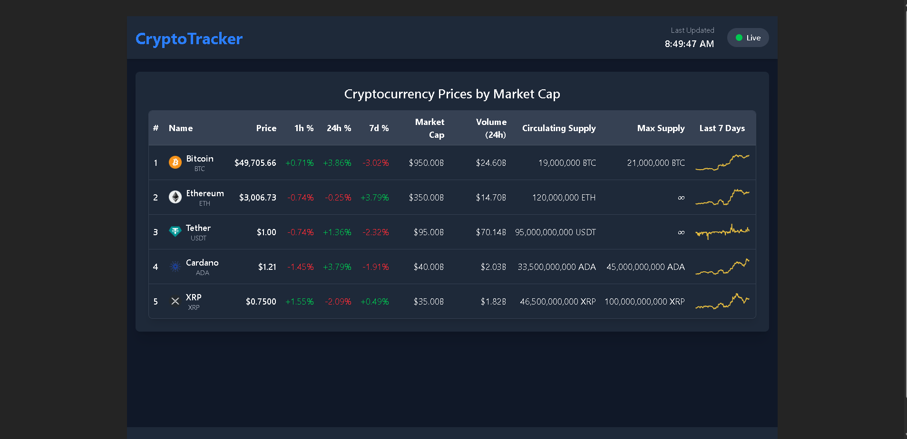

#  Real-Time Crypto Price Tracker

A responsive **React + Redux Toolkit** app that simulates real-time crypto market data updates, inspired by platforms like CoinMarketCap. Built as part of a frontend internship assignment at **UaiXivTech**.

##  Demo

🎥 **Watch the demo:**  
[Click here to watch the Loom video](https://www.loom.com/share/f2377f5f42c44017a135ff4bc0d3f511)

##  Preview



## live demo: [Crypto Tracker Live Demo](https://crytotracketlive.netlify.app/)


---

##  Tech Stack

- **React** (Functional Components & Hooks)
- **Redux Toolkit** (createSlice, configureStore)
- **JavaScript** for data mocking & interval updates
- **CSS/Tailwind CSS** for styling

---

## Features

✅ Displays 5 cryptocurrencies in a dynamic table  
✅ Simulated real-time price updates every 1–2 seconds  
✅ Redux Toolkit for centralized state management  
✅ Color-coded % changes (green/red) for price fluctuation  
✅ Fully responsive table layout  
✅ Static 7-day chart placeholders  
✅ Clean and reusable component structure  
✅ Support for interval-based price updates via Redux actions

---

## Real-Time Update Logic

Instead of a live WebSocket, the app uses a mocked simulation with `setInterval()` to:

- Randomly update:
  - Price
  - Percentage changes (1h, 24h, 7d)
  - 24h trading volume

These updates are dispatched via **Redux actions**, and the Redux store handles all state changes centrally.

---

##  Project Structure

```
src/
├── app/                # Redux store configuration
├── assets/             # Logos, images, static charts
├── components/         # UI components like Table, Row, etc.
├── data/               # Static or mock crypto data (if used)
├── features/           # Redux slices and state logic
├── hooks/              # Custom hooks (optional)
├── services/           # API or simulated WebSocket logic
├── utils/              # Utility functions for random updates
├── App.jsx             # Root component
├── App.css
├── main.jsx            # Entry point
└── index.css           # Global styles
```

---

##  Setup Instructions

```bash
# 1. Clone the repo
git clone https://github.com/your-username/crypto-tracker.git

# 2. Navigate to the folder
cd crypto-tracker

# 3. Install dependencies
npm install

# 4. Run the app
npm start
```

---

##  Developer Note

> I’ve honestly never worked on a real-world project involving Redux or WebSocket before. This was my **first hands-on experience using Redux Toolkit**, and I learned a lot while building this app.
>
> I also took some help from **AI tools like ChatGPT** to understand Redux better, simulate real-time logic properly, and debug parts of the app. My goal was to create a functional, clean, and responsive solution based on the assignment brief.

---

##  Optional Future Enhancements

- Integrate real WebSocket API (e.g., Binance)
- Add filtering and sorting (top gainers/losers)
- LocalStorage support for persistence
- Add TypeScript support
- Unit tests for reducers and selectors

---

##  Author

**Krushna WebDev**  
📧 krushna.webdev26@gmail.com  
🌐 [GitHub](https://github.com/Krushna-WebDev) | [LinkedIn](https://www.linkedin.com/in/krushna-web-dev-2b347b353)

---
